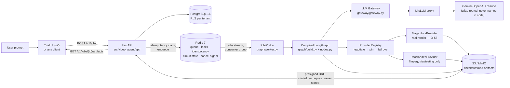
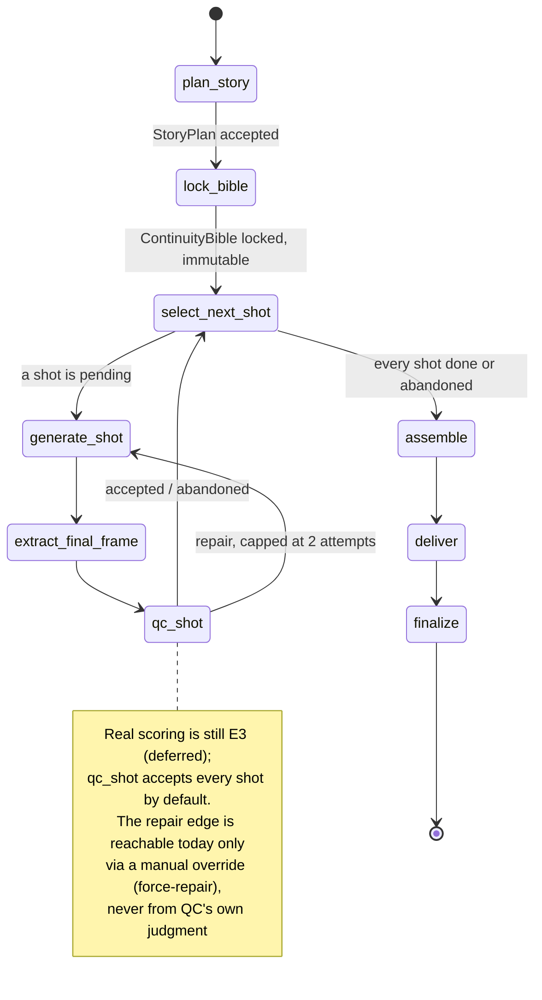

# Video Agent

One prompt becomes a continuous 40-second story — four 10-second shots with enforced
narrative and visual continuity. Text-to-video models generate good clips in isolation, but
four clips from four prompts drift: the protagonist's face changes, the room's color changes,
the story never moves. This is the continuity engine around the generator — a planned 4-beat
arc, a locked continuity bible, frame chaining between shots, and a vision-model QC loop that
repairs only the shot that broke.

Design complete; build scoped to E0–E2 (planning, continuity bible, the Magic Hour adapter,
frame chaining, assembly, delivery). v1 renders via **[Magic Hour](https://magichour.ai)** in
place of the PRD's Higgsfield MCP (decision `D-58`) — full rationale and every other design
decision in [HLD Appendix A](./docs/HLD.md#appendix-a--design-decision-register).

## Watch the pitch

Recorded demo — a real job run end to end against the live Magic Hour API:
[watch on Google Drive](https://drive.google.com/file/d/10H5C37x4SgAPLIEbYK9ATuuRK94uRzh-/view?usp=sharing).
Walkthrough script: [`PITCH_SCRIPT.md`](./PITCH_SCRIPT.md).

## Architecture

**System view** — a prompt in, a delivered video out, and everything it passes through.



**Job pipeline** — the LangGraph state machine every job runs through. Every arrow into a node
is guarded by the harness, which can terminate the job from any step (omitted for readability —
see [`docs/LLD/graph.md`](./docs/LLD/graph.md) §3).



Every node checkpoints in the **same database transaction** as its own domain write — a crash
resumes from there, not from the top (v1's simplified crash recovery re-enters at the graph's
entry point rather than the last checkpoint; see [`graph/worker.py`](./src/video_agent/graph/worker.py)).

## Repository layout

```
.
├── README.md                  ← you are here (navigation only)
├── AGENT.md                   ← operating procedures for AI agents working in this repo
├── docs/
│   ├── HLD.md                 ← the system design
│   ├── LLD/                   ← one document per module
│   │   ├── api.md             ├── graph.md        ├── qc.md
│   │   ├── harness.md         ├── planning.md     ├── assembly.md
│   │   ├── gateway.md         ├── providers.md    ├── persistence.md
│   │   └── observability.md
│   ├── specs/                 ← source of truth; do not edit without a spec change
│   │   ├── common-platform-spec.md
│   │   └── video-agent-prd.md
│   ├── setup.md                ← running the project locally (mock + real Magic Hour)
│   ├── start-here.md           ← where to read next, by goal
│   ├── modules.md               ← module → responsibility → v1 scope
│   ├── features.md              ← full feature list with code links
│   ├── module-status.md         ← what's built vs. deferred, per module
│   └── cdr-workflow.md          ← how the canonical docs are maintained
├── prompts/                   ← prompt text, versioned in-repo, source of truth [D-72]
├── .env.example               ← configuration contract
├── Guidelines.pdf             ← origin PDF for common-platform-spec.md
├── Video-Agent.pdf            ← origin PDF for video-agent-prd.md
└── .cdr/                      ← CDR state: runs, indexes, memory, schemas
```

## Read more

- [`docs/setup.md`](./docs/setup.md) — running it locally, mock provider or a real Magic Hour job
- [`docs/start-here.md`](./docs/start-here.md) — where to read next, by goal
- [`docs/modules.md`](./docs/modules.md) — module → responsibility → v1 scope
- [`docs/features.md`](./docs/features.md) — full feature list with code links
- [`docs/module-status.md`](./docs/module-status.md) — what's built vs. deferred, per module
- [`docs/cdr-workflow.md`](./docs/cdr-workflow.md) — how the canonical docs are maintained
- [`docs/HLD.md`](./docs/HLD.md) — the system design
