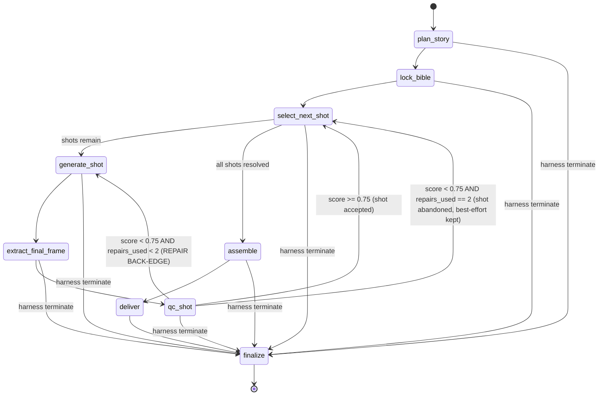

# Video Agent — High Level Design

This document describes **the system**. Implementation detail lives in [`docs/LLD/`](./LLD/).
Nothing here may contradict [`common-platform-spec.md`](./specs/common-platform-spec.md) (CPS)
or [`video-agent-prd.md`](./specs/video-agent-prd.md) (PRD).

## Traceability convention

Every normative statement in this document carries one of three tags:

| Tag | Meaning |
| --- | --- |
| `[CPS §Section]` | Inherited verbatim in substance from the Common Platform Specification. Not negotiable here. |
| `[PRD §Section]` | Stated by the Video Agent PRD. Not negotiable here. |
| `[D-nn]` | A design decision this document makes because **neither spec covers it**. Listed with rationale in [Appendix A](#appendix-a--design-decision-register). |

If you find an untagged normative claim, it is a documentation bug. Open a CDR
documentation run rather than guessing.

---

## 1. Problem statement and the continuity thesis

Text-to-video models generate clips of 5–10 seconds in isolation. Give four prompts to a
generator and you get four unrelated clips: the protagonist changes face, the room changes
colour, the story never moves. **Generation is solved; continuity is not.** `[PRD §The problem]`

The product therefore is not a generator. It is a **continuity engine wrapped around a
generator**. One prompt becomes a continuous 40-second story — four 10-second shots with
enforced narrative and visual continuity. `[PRD §header]`

Every architectural choice in this document is downstream of that thesis. Where a choice
costs latency, cost or complexity, the test applied is: *does it protect continuity?* If yes,
the cost is paid. If no, it is cut.

Continuity is enforced by four mutually reinforcing mechanisms, none of which is sufficient
alone:

1. **A narrative spine** — a 4-beat arc planned in one pass before any pixel is generated,
   so the story moves. `[PRD §How it works 1]`
2. **A locked continuity bible** — canonical character, wardrobe, location, lighting,
   palette and lens language, immutable for the life of the job, injected into every shot
   prompt. `[PRD §How it works 2]`
3. **Frame chaining** — the final frame of shot *n* conditions shot *n+1*, so visual
   identity carries forward. `[PRD §How it works 4]`
4. **A QC and repair loop** — a vision model scores each shot against the bible; failures
   regenerate that shot only. `[PRD §How it works 5]`

Mechanisms 2 and 3 are *preventive*; mechanism 4 is *detective and corrective*. The system
does not rely on the generator being good. It relies on being able to tell when the
generator was bad, and on making that cheap to fix.

---

## 2. System context

```
                       ┌──────────────────────────────┐
   client ──POST /v1/jobs──▶│  FastAPI async surface   │  docs/LLD/api.md
                       │  idempotency, error envelope │
                       └──────────────┬───────────────┘
                                      │ enqueue job
                       ┌──────────────▼───────────────┐
                       │      Agent harness           │  docs/LLD/harness.md
                       │  context · tools · budgets   │
                       │  TERMINATION OWNER           │
                       └──────────────┬───────────────┘
                                      │ drives
                       ┌──────────────▼───────────────┐
                       │   LangGraph StateGraph       │  docs/LLD/graph.md
                       │   checkpoint after every node│
                       └───┬──────────┬───────────┬───┘
                           │          │           │
              ┌────────────▼──┐  ┌────▼──────┐  ┌─▼──────────────┐
              │ planning      │  │ providers │  │ assembly       │
              │ + qc  (LLM)   │  │ (video)   │  │ (ffmpeg)       │
              └───────┬───────┘  └────┬──────┘  └─┬──────────────┘
                      │               │           │
              ┌───────▼───────┐  ┌────▼──────┐    │
              │ LiteLLM proxy │  │ Magic Hour│    │
              │ SINGLE LLM    │  │ REST API  │    │
              │ EGRESS        │  │ (+ others)│    │
              └───────────────┘  └───────────┘    │
                                                  │
     ┌────────────────────────────────────────────▼──────────────┐
     │ PostgreSQL 16 (RLS/tenant) · Redis 7 · object store       │  docs/LLD/persistence.md
     └───────────────────────────────────────────────────────────┘
                                  │
     ┌────────────────────────────▼──────────────────────────────┐
     │ Langfuse — traces, spans, generations, scores, prompts    │  docs/LLD/observability.md
     └───────────────────────────────────────────────────────────┘
```

Work is dispatched from the API to workers over **Redis Streams with consumer groups**,
at-least-once `[D-67]`; callers authenticate with **static per-tenant API keys** `[D-68]`.

The canonical stack is inherited wholesale and is not re-litigated here:
Python 3.12 / FastAPI async · LiteLLM proxy as single egress for every model call ·
Gemini/OpenAI/Claude by logical alias only · LangGraph compiled `StateGraph` ·
Langfuse · PostgreSQL 16 with RLS per tenant · pgvector or MongoDB Atlas behind one
protocol · Redis 7 for cache, locks, rate limits, idempotency and progress. `[CPS §Canonical stack]`

Note that the vector store and the `realtime-voice` and `embed-default` aliases are part of
the inherited platform but have **no consumer in Video Agent v1** — there is no retrieval
surface and voiceover is out of scope. They are declared, not built. `[D-13]`

---

## 3. The job lifecycle as a LangGraph StateGraph

Every agent is a compiled `StateGraph`. `[CPS §Canonical stack]` The Video Agent's graph
encodes the six-step method of `[PRD §How it works]` directly.

### 3.1 The graph



### 3.2 Nodes

| Node | Does | Model alias | Side effects | Spec |
| --- | --- | --- | --- | --- |
| `plan_story` | One LLM pass produces the 4-beat arc (setup, development, turn, resolution) summing to exactly 40s | `reasoning-high` | writes `StoryPlan` | `[PRD §How it works 1]`, `[CPS §Model routing]` |
| `lock_bible` | Derives and **locks** the continuity bible: character, wardrobe, location, lighting, palette, lens language. Immutable thereafter | `reasoning-high` | writes `ContinuityBible`, sets `locked_at` | `[PRD §How it works 2]` |
| `select_next_shot` | Pure router. Picks the lowest-index unresolved shot; carries `last_good_frame` forward | none | none | `[D-04]` |
| `generate_shot` | Composes `bible + beat action + camera move`, conditions on the chained frame, calls the video provider through the abstraction | video capability alias `[D-06]` | writes `ShotAttempt` + clip `Artifact` | `[PRD §How it works 3, 4]` |
| `extract_final_frame` | ffmpeg-extracts the last frame of the accepted-so-far clip; this becomes shot *n+1*'s conditioning image | none | writes continuity-frame `Artifact` | `[PRD §How it works 4]` |
| `qc_shot` | Vision model scores the clip and its frames against the bible, per dimension, with rationale | `vision-default` | writes QC score + Langfuse score | `[PRD §How it works 5]`, `[CPS §Model routing]` |
| `assemble` | ffmpeg stitch and normalise, optional music bed, thumbnail. Assembles **whatever succeeded** | none | writes final MP4 + thumbnail `Artifact` | `[PRD §How it works 6]`, `[PRD §Resilience]` |
| `deliver` | Mints presigned URLs for MP4, per-shot clips, thumbnail, continuity frames, `StoryPlan` and `ContinuityBible` JSON | none | writes delivery manifest | `[PRD §How it works 6]`, `[PRD §What's delivered]` |
| `finalize` | Records the terminal outcome, degraded flag, spend and reason. Reachable from every node | none | closes `Job`, closes trace | `[CPS §Agent harness]` |

`select_next_shot` and `finalize` are not in the PRD's six steps; they exist because the
PRD's sequential loop and four termination outcomes need somewhere to live. `[D-04]`

### 3.3 Edges

| From | To | Condition |
| --- | --- | --- |
| `START` | `plan_story` | always |
| `plan_story` | `lock_bible` | plan validates (4 beats, sums to exactly 40s) |
| `lock_bible` | `select_next_shot` | bible complete on all six dimensions |
| `select_next_shot` | `generate_shot` | at least one shot unresolved |
| `select_next_shot` | `assemble` | all four shots resolved (accepted or abandoned) |
| `generate_shot` | `extract_final_frame` | provider returned a clip |
| `extract_final_frame` | `qc_shot` | always |
| `qc_shot` | `select_next_shot` | `continuity_score >= 0.75` → shot **accepted** |
| `qc_shot` | `generate_shot` | `continuity_score < 0.75` **and** `repairs_used < 2` → **repair back-edge** |
| `qc_shot` | `select_next_shot` | `continuity_score < 0.75` **and** `repairs_used == 2` → shot **abandoned**; its best attempt is retained for partial assembly |
| `assemble` | `deliver` | at least one shot produced a usable clip |
| `assemble` | `finalize` | zero usable clips → `FAILED`, zero deliverable |
| `deliver` | `finalize` | always |
| *any node* | `finalize` | the harness returns a terminate decision |

**The repair back-edge is the only cycle in the graph, and it is capped at 2 traversals per
shot.** `[PRD §How it works 5]` A shot therefore costs at most **three** generations: one
initial plus two repairs. See `[D-01]` for why "capped at 2 attempts" is read as two
*repair* attempts.

### 3.4 The sequential shot loop

The loop is expressed as a **self-referencing subgraph with an index in state**, not as four
statically unrolled node chains. `[D-04]` Reasons:

- Resume must re-enter the loop at an arbitrary shot index without replaying earlier shots.
- Shot-level regeneration (`fix shot 3, leave 1, 2 and 4 byte-identical` `[PRD §Resilience]`)
  is then just an entry into the loop with a pre-seeded resolved-set.
- The repair back-edge is one edge rather than four copies of one edge.

State carried across the loop:

| Field | Purpose |
| --- | --- |
| `shot_index` | which beat is being rendered |
| `repairs_used[shot_index]` | enforces the cap of 2 |
| `last_good_frame_artifact_id` | the conditioning image for the next generation |
| `resolved[]` | per shot: `accepted` / `abandoned`, with the best attempt id |

**Chaining after a failure.** If shot *n* is abandoned, shot *n+1* conditions on the most
recent *successful* final frame, not on the abandoned shot's frame. If no shot has yet
succeeded (shot 1 abandoned), shot 2 is generated text-only from the bible and the beat, and
the job is flagged `degraded`. `[D-05]` Neither spec covers this and it is unavoidable: the
PRD requires both frame chaining and continuing after a shot failure.

---

## 4. Where the harness sits

The harness owns context, tools, budgets and termination. **The model is a component inside
it, never the controller.** `[CPS §Agent harness & loop engine]`

```
observe → think → act → evaluate → repeat | terminate | escalate
```

This loop is **not** a second scheduler running beside LangGraph. The mapping is exact and
one-to-one with a graph superstep:

| Harness phase | Realised as |
| --- | --- |
| **observe** | Load the checkpointed `JobState` for the node about to run, plus the harness-assembled context (bible, beat, chained frame, prior QC findings). The node never fetches its own context. |
| **think** | The node's model call, made through the gateway by logical alias. Produces *content* — a plan, a bible, a score, a corrective prompt delta. |
| **act** | The node's side effect — provider call, ffmpeg invocation, artifact write. |
| **evaluate** | The post-node evaluator: charge the budget ledger, compute the failure signature, apply the node's acceptance predicate (for `qc_shot`, the 0.75 threshold). |
| **repeat / terminate / escalate** | The conditional edge function, which **must** consult `harness.decide(state)` before it consults any node-local condition. |

```
   ┌──────────────────── HARNESS (owns termination) ─────────────────────┐
   │                                                                      │
   │  budget ledger · failure-signature memory · tool registry · context  │
   │                                                                      │
   │   ┌────────────── one superstep = one harness iteration ─────────┐   │
   │   │  observe  →  think (model)  →  act  →  evaluate              │   │
   │   └───────────────────────────┬──────────────────────────────────┘   │
   │                               │                                      │
   │                    harness.decide(state)                             │
   │                     ├── CONTINUE   → follow the graph edge           │
   │                     ├── TERMINATE  → jump to finalize with outcome   │
   │                     └── ESCALATE   → jump to finalize, flag human    │
   └──────────────────────────────────────────────────────────────────────┘
```

### 4.1 Who owns termination

**The harness, and only the harness.** Concretely, this means three prohibitions that the
implementation must uphold:

1. **No node may end the graph.** Nodes return state deltas. Only `finalize` is terminal, and
   only the harness routes to it.
2. **No model output may select an edge.** A model may emit a *score*; the harness compares
   the score to a threshold it owns. A model may emit a *plan*; the harness validates it. A
   model may never emit "next node" or "stop". This is the `[CPS §Agent harness]` rule that
   the model is a component, never the controller — and it is also the enforcement point for
   `untrusted content never issues instructions` `[CPS §Non-negotiables]`, because provider
   output and QC rationale are untrusted content.
3. **Every conditional edge calls `harness.decide` first.** Budget exhaustion and no-progress
   must be able to pre-empt any node-local routing rule, including the repair back-edge.

The graph decides *what work to do next*. The harness decides *whether there is a next at
all*. See [`docs/LLD/harness.md`](./LLD/harness.md).

---

## 5. Termination outcomes

Four outcomes, inherited exactly. `[CPS §Agent harness & loop engine]` What each means for a
video job:

| Outcome | Trigger `[CPS]` | Meaning for a video job | Delivered |
| --- | --- | --- | --- |
| `SUCCESS` | Evaluator satisfied | All four shots reached `continuity_score >= 0.75` and the stitched 40s MP4 assembled cleanly. | Full manifest: 40s MP4, four 10s clips, thumbnail, continuity frames, `StoryPlan` + `ContinuityBible` JSON, per-shot cost/model/prompt/provider-project-id, with seed recorded as unsupported `[D-59]`. `[PRD §What's delivered]` |
| `PARTIAL` | Budget exhausted (iterations, time, tokens, USD) — best-so-far, flagged degraded | One or more shots were abandoned below threshold, or a budget cap stopped the run mid-loop. **At least one shot succeeded, so a stitched partial is delivered with a working resume.** `[PRD §Resilience]` The MP4 is shorter than 40s or contains a below-threshold shot. | Partial MP4 + every shot that succeeded + a `resume` affordance. `degraded: true` and the reason are on the response. |
| `FAILED_NO_PROGRESS` | Same failure signature twice — stop immediately | The job repeated an identical failure at job scope (e.g. the planner produced the same invalid plan twice, or the provider returned the same non-retryable rejection for two consecutive shots). Stopping immediately is the budget defence against repair loops. `[PRD §Key risks]` | Whatever was preserved, plus the signature that stopped it. Never silently retried. |
| `FAILED` / `ESCALATED` | Non-retryable error / human trigger | `FAILED`: a non-retryable error with **zero** usable shots — this is the "job failing with zero deliverable" case the PRD targets at `< 1%`. `ESCALATED`: an operator or a policy trigger removed the job from automation. `[D-12]` | `FAILED`: an honest error envelope — what happened, what was preserved, what to do next `[CPS §Failure behaviour]`. `ESCALATED`: the same, plus an operator handle. |

Two scopes of "same failure signature twice" must be distinguished, because the PRD's repair
loop deliberately retries the same shot: `[D-02]`

- **Shot scope** — the same shot fails QC twice on the same dimension set with no score
  improvement. The *shot* is abandoned; the *job* continues to the next shot. This is what
  keeps "never returns nothing" true.
- **Job scope** — the same signature recurs across different shots or at a non-shot node.
  The *job* stops immediately with `FAILED_NO_PROGRESS`.

Only job scope produces the `FAILED_NO_PROGRESS` outcome.

---

## 6. Model routing

**Code never names a provider.** Aliases resolve at the gateway, so swapping models is a
config change with zero code diff. `[CPS §Model routing]` This is a hard rule, restated as an
agent non-negotiable in [`AGENT.md`](../AGENT.md) and enforced by CI.

| Consumer | Alias | Why this alias |
| --- | --- | --- |
| `plan_story` | `reasoning-high` | Planning `[CPS §Model routing]` |
| `lock_bible` | `reasoning-high` | Canonical-artifact synthesis and self-critique; the bible is immutable once written, so it gets the strongest model available. `[D-07]` |
| `qc_shot` | `vision-default` | Frame inspection, continuity QC — the alias's stated purpose `[CPS §Model routing]` |
| repair prompt delta (inside `generate_shot`) | `reasoning-fast` | A bounded transformation of QC findings into a corrective prompt delta — extraction, not critique. `[D-07]` |
| `generate_shot` video call | **not a LiteLLM alias** — a video *capability* alias resolved by the provider registry | Video generation is not an LLM call and does not traverse the LiteLLM proxy. It inherits the same alias-only discipline through a parallel registry. `[D-06]` |
| — | `embed-default` | No consumer in v1 (no retrieval surface). `[D-13]` |
| — | `realtime-voice` | No consumer in v1 (voiceover out of scope `[PRD §Out of scope]`). `[D-13]` |

`[D-06]` is the one place the inherited rule "LiteLLM proxy — single egress for **every model
call**" needed interpretation. Resolution: LiteLLM is the single egress for every **LLM**
call; video generation egresses through the provider abstraction, which is bound by the same
`[CPS §Failure behaviour]` policy (retry, fallback, circuit break, degrade, fail honestly)
and the same alias-only rule. Application code never writes the string `magichour`.
See [`docs/LLD/gateway.md`](./LLD/gateway.md) and [`docs/LLD/providers.md`](./LLD/providers.md).

---

## 7. The sequential-not-parallel trade-off

**Deliberate decision, inherited from the PRD, not open for re-optimisation without a
product decision.**

> Shots run **sequentially, not in parallel**. Parallel is roughly 4× faster but breaks frame
> chaining, and frame chaining is what makes the product work. Latency was traded for the
> core value proposition. `[PRD §Deliberate trade-off]`

Consequences the architecture must absorb rather than fight:

| Consequence | How the design absorbs it |
| --- | --- |
| End-to-end latency is the **sum** of four generations plus QC, not the max | The p90 target is set at `≤ 8 min` accordingly `[PRD §Success metrics]`; the hard wall-clock cap is set well above it so the cap is a safety net, not the common path `[D-08]`. |
| A slow or failing shot stalls the whole job | Per-shot soft time budget + the repair cap + `select_next_shot` moving on after abandonment. |
| A crash mid-loop is expensive to redo | Checkpoint after every node `[CPS §Non-negotiables]`, so resume re-enters at the exact shot, and completed shots are never regenerated or re-billed `[PRD §Resilience]`. |
| Users see nothing for minutes | Progress is published per node to Redis and streamed to the client `[D-09]`. |

What is *not* parallelised: the four shots. What **is** safely concurrent: multiple **jobs**,
and within a shot, artifact upload alongside QC scoring. `[D-10]`

---

## 8. Resilience

Four guarantees from `[PRD §Resilience]`, each mapped to the mechanism that makes it true:

### 8.1 Never returns nothing
If one shot succeeded, a stitched partial is delivered with a working resume. `assemble` is
reachable from `select_next_shot` regardless of how many shots were abandoned, and it
stitches whatever exists. Only the zero-usable-shot case produces no deliverable, which is
the case the PRD budgets at `< 1%`. See [`docs/LLD/assembly.md`](./LLD/assembly.md).

### 8.2 Resume, don't restart
Completed shots are never regenerated or re-billed. Enforced by two independent mechanisms so
that a bug in either does not cause a double charge:
- The LangGraph checkpointer keyed on `job_id` restores the exact loop state. `[CPS §Non-negotiables]`
- `select_next_shot` reads `resolved[]` from Postgres, which is the system of record — a shot
  already marked `accepted` is skipped even if the checkpoint is stale. `[D-11]`

### 8.3 Shot-level regeneration
Fix shot 3, leave 1, 2 and 4 byte-identical. Regeneration enters the loop with
`shot_index = 3` and `resolved[]` pre-populated for 1, 2 and 4; those artifacts are re-used
by reference, never re-encoded. Byte-identity is asserted by comparing artifact checksums
before and after. `[D-11]`

### 8.4 Provider abstraction
Capability negotiation plus failover, so an API change is not an outage. A provider declares
capabilities (clip duration range, resolution ceiling, image conditioning, seed control,
async polling, webhook callback);
the registry selects a provider that satisfies the shot's requirements and fails over within
the capability group on circuit-break. `[PRD §How it works 3]`, `[PRD §Resilience]`

**This abstraction has already paid for itself.** The PRD names **Higgsfield MCP**, but
Higgsfield exposes **no free or trial API tier** and no credential was obtainable for this
build, so the v1 provider is **Magic Hour** instead `[D-58]`. The substitution is sound
because Magic Hour accepts a start-frame image and therefore satisfies `IMAGE_CONDITIONING` —
**frame chaining, and with it the continuity thesis of §1, is preserved**. The swap touched
one adapter module and config, and no other module: exactly the outcome `[D-06]` and the
alias-only rule were designed to produce. Magic Hour is the first adapter, not the interface.
See [`docs/LLD/providers.md` §7](./LLD/providers.md#7-magic-hour-adapter).

### 8.5 Inherited failure behaviour
Applies to every dependency, LLM and video alike: retry with exponential backoff and jitter,
retryable errors only, max 3 · fallback to an alternate model within the alias group ·
circuit break per dependency at 5 failures in 30s · degrade to a cached, stale or partial
result, always flagged · fail honestly — what happened, what was preserved, what to do next.
Every error response carries a stable code and the `trace_id`. `[CPS §Failure behaviour]`

---

## 9. Data model sketch

Authoritative DDL lives in [`docs/LLD/persistence.md`](./LLD/persistence.md). This is the
shape and the relationships.

```
Tenant 1───n Job
              │
              ├─1───1 StoryPlan ──1───4 Beat
              ├─1───1 ContinuityBible        (immutable once locked)
              ├─1───4 Shot ──1───n ShotAttempt ──1───n Artifact
              ├─1───n Artifact               (final MP4, thumbnail, JSON exports)
              └─1───n Checkpoint             (one per node execution)
```

| Entity | Holds | Notes |
| --- | --- | --- |
| `Job` | tenant, prompt, status, terminal outcome, `degraded` flag, budget caps and spend, `trace_id`, idempotency key | The unit of work = one Langfuse trace `[CPS §Observability]` |
| `StoryPlan` | logline, the 4 beats, total duration (always 40), producing model + prompt version | Delivered as machine-readable JSON `[PRD §What's delivered]` |
| `Beat` | index 0–3, kind (`setup`/`development`/`turn`/`resolution`), action, camera move, duration | Durations sum to exactly 40s `[PRD §How it works 1]`; v1 fixes 10s each `[D-03]` |
| `ContinuityBible` | character, wardrobe, location, lighting, palette, lens language, `locked_at`, content hash | **Immutable for the life of the job** `[PRD §How it works 2]`. Enforced by DB trigger, not by convention. |
| `Shot` | beat reference, index, status (`pending`/`accepted`/`abandoned`), best attempt, final continuity score | One per beat |
| `ShotAttempt` | attempt number, provider, provider model, seed *(null where unsupported)*, provider project id, full prompt text + hash, cost USD + credits charged, QC score and per-dimension findings | Carries the reproducibility contract: per-shot cost, model, seed and prompt `[PRD §What's delivered]`. **The seed leg is unmet in v1** — Magic Hour documents no seed parameter, so traceability is delivered but bit-exact re-rendering is not `[D-59]` |
| `Artifact` | kind (`shot_clip`/`final_video`/`thumbnail`/`continuity_frame`/`story_plan_json`/`bible_json`), storage key, checksum, bytes, media metadata | Bytes live in object storage; only metadata + key in Postgres. Delivered as presigned URLs `[PRD §How it works 6]` |
| `Checkpoint` | thread (= `job_id`), node, serialised state, created_at | Written after every node `[CPS §Non-negotiables]` |

**RLS per tenant on PostgreSQL 16** is mandatory and applies to every table above.
`[CPS §Canonical stack]` Postgres is the system of record; Redis 7 holds cache, locks, rate
limits, idempotency and progress and is never authoritative. `[CPS §Canonical stack]`

---

## 10. Observability model

Inherited exactly: **Trace = one unit of work. Spans = graph nodes. Generations = LLM calls
with model, tokens, cost and prompt version.** Logs are JSON with the Langfuse `trace_id`, so
any log line joins to its trace. `[CPS §Observability]`

Concretely for this agent:

| Langfuse concept | Video Agent binding |
| --- | --- |
| Trace | one `Job` — `trace_id` is persisted on the job row and returned on every response and every error |
| Span | one graph node execution — `plan_story`, `generate_shot`, `qc_shot`, … Nested spans for provider calls and ffmpeg invocations |
| Generation | one LLM call through the gateway, with model, tokens, cost and prompt version |
| Score | the per-shot continuity score and its per-dimension breakdown, plus human coherence ratings when collected |
| Prompt registry | planner, bible, QC and repair-delta prompts are versioned in Langfuse; the version used is recorded on every generation |

**Never logged:** credentials, raw PII, full media payloads, row-level query results.
`[CPS §Observability]` For this agent that concretely forbids: provider API keys and MCP
credentials · the user's raw prompt where it may contain personal data (hashed and truncated
instead) · video or frame bytes, or base64 thereof, in any log line or trace attribute —
artifacts are referenced by storage key only · presigned URLs (they are bearer credentials).
See [`docs/LLD/observability.md`](./LLD/observability.md) for the redaction rules.

---

## 11. Success metrics and instrumentation

`[PRD §Success metrics]`, with the measurement mechanism for each `[D-14]`:

| Metric | V1 target | How it is measured |
| --- | --- | --- |
| Story coherence (human, 1–5) | ≥ 4.0 | Human rating submitted as a Langfuse **score** (`coherence_human`) on the job trace, from a sampled review queue. Reported as a rolling mean over the review window. |
| Jobs with continuity score ≥ 0.75 | ≥ 85% | Job-level continuity score = the **minimum** across its four shots `[D-15]`, emitted as a Langfuse score (`continuity_job`). The metric is the fraction of completed jobs at or above 0.75. |
| p90 end-to-end job latency | ≤ 8 min | Trace duration from job accept to `deliver`, p90 over completed jobs. Node-level span durations attribute regressions to a node. |
| Jobs failing with zero deliverable | < 1% | Fraction of terminal jobs that delivered **no playable video artifact** — no stitched MP4 and no individual shot clip. **`StoryPlan` and `ContinuityBible` JSON explicitly do not count** `[D-73]`. `PARTIAL` does not count, since a partial by definition has at least one clip. |

> **Why the zero-deliverable definition needed fixing `[D-73]`.** An earlier version defined
> it as `FAILED`/`FAILED_NO_PROGRESS` **and zero artifacts**. But
> [`assembly.md` §5](./LLD/assembly.md#5-partial-assembly) returns the plan and bible JSON even
> in the total-failure case — and those are artifacts. Read literally, the metric would always
> report 0% and the `< 1%` target could never be exceeded. **A metric that cannot fail measures
> nothing**, and this one is a headline PRD commitment.

These are also the CI eval gates: eval regression `> 3%` and cost regression `> 20%` block a
merge. `[CPS §Non-negotiables]` Cost per job is summed from generation costs plus provider
attempt costs on the `ShotAttempt` rows, converted from provider credits at the configured
rate `[D-65]`.

**Key risks and their mitigations** are carried over unchanged `[PRD §Key risks]`: provider
can't hold identity across clips → frame chaining + locked bible + QC loop · QC itself
unreliable, wasting spend → calibrate on a labelled set, cap attempts · repair loops blow the
budget → hard USD cap plus no-progress detection.

---

## 12. Delivery milestones

`[PRD §Delivery]`, unchanged. The module set in [`docs/LLD/`](./LLD/) is organised so each
milestone lands whole modules rather than slices of many.

| Epic | Milestone | Scope | Primary modules | v1 build |
| --- | --- | --- | --- | --- |
| **E0** | M0 | Foundation: config, schema, RLS, gateway, logging | `persistence`, `gateway` | **in scope** |
| **E1** | M1–M2 | Job lifecycle, planning, continuity bible | `api`, `harness`, `graph`, `planning` | **in scope** |
| **E2** | M3 | Higgsfield MCP, frame chaining, assembly — **delivered against Magic Hour** `[D-58]` | `providers`, `assembly` | **in scope** |
| **E3** | M4 | QC loop, partial results, resume | `qc`, `graph` (repair edge, resume), `assembly` (partial) | **deferred** |
| **E4** | M5 | Observability, cost caps, load + chaos | `observability`, `harness` (budgets) | **deferred** |

> ### Build scope: E0 + E1 + E2
>
> The v1 build target is **E0, E1 and E2** — foundation, job lifecycle, planning, continuity
> bible, the Magic Hour adapter, frame chaining, assembly and delivery. **E3 (QC loop, partial
> results, resume) and E4 (observability, cost caps, load and chaos) are deferred, not
> cancelled.**
>
> **This document and the LLDs describe the full design, not the current runtime.** Every LLD
> carries an `implementation_status` in its front-matter and a status callout at the top. Two
> modules — [`qc`](./LLD/qc.md) and [`observability`](./LLD/observability.md) — are wholly
> deferred and must be read as specifications rather than as descriptions of running code.
>
> The practical consequence for v1: a shot that scores below the threshold is **not repaired**,
> because the repair back-edge is part of E3. The graph, the cap and the data model are all in
> place for it; the edge is simply not wired.

---

## 13. Out of scope (v1)

Copied faithfully from `[PRD §Out of scope (v1)]`:

> Dialogue and lip-sync · durations other than 40s · user-supplied reference characters ·
> voiceover · editing timeline · above 1080p.

Nothing in this HLD or in any LLD may design for these. In particular: no configurable job
duration, no reference-image upload endpoint, no audio track beyond the optional music bed
that `[PRD §How it works 6]` explicitly permits, and 1080p is a hard resolution ceiling
negotiated with the provider.

---

## Appendix A — design decision register

Decisions this document makes because **neither spec covers them**. Each is a candidate for
revision by a product or architecture decision, and each is mirrored in
`.cdr/index/decision.jsonl`.

| ID | Decision | Rationale |
| --- | --- | --- |
| `D-01` | "Capped at 2 attempts" means **2 repair attempts after the initial generation** — max 3 generations per shot. | The PRD sentence is "failures regenerate that shot only, capped at 2 attempts"; the cap qualifies the *regenerations*. Reading it as 2 total would allow only one repair, which cannot recover a two-dimension failure. The cost ceiling is bounded either way by the hard USD cap. |
| `D-02` | Failure signatures have two scopes: shot scope abandons a shot, job scope terminates the job with `FAILED_NO_PROGRESS`. | `[CPS]` says "same failure signature twice → stop immediately", but `[PRD]` mandates a repair loop that by construction retries the same shot. Without scoping, the two rules contradict. Scoping preserves both: repeated identical *shot* failure stops that shot; repeated identical failure *across* the job stops the job. |
| `D-03` | v1 fixes every beat at exactly 10s. Beats carry a `duration_s` field, validated to sum to 40. | `[PRD §header]` says "four 10-second shots"; `[PRD §How it works 1]` says only "summing to exactly 40s". Uneven beats would be a superset, but "durations other than 40s" is out of scope and providers quantise clip length. The field exists so unequal beats are a config change, not a schema migration. |
| `D-04` | The shot loop is a self-referencing subgraph with an index in state, plus a `select_next_shot` router and a `finalize` sink. | Neither node appears in the PRD's six steps, but resume, shot-level regeneration and the four termination outcomes all need an addressable entry point and a single terminal node. |
| `D-05` | If a shot is abandoned, the next shot chains from the most recent **successful** final frame; if none exists, it is generated text-only from the bible and the job is flagged degraded. | The PRD requires both frame chaining and continuing after a shot failure, and is silent on their intersection. Chaining from a known-bad frame would propagate the defect. |
| `D-06` | Video generation does not traverse the LiteLLM proxy. It uses a parallel provider registry with capability aliases, bound by the same failure-behaviour policy and the same never-name-a-provider rule. | `[CPS]` says LiteLLM is the single egress for every *model call*; LiteLLM does not front video generation APIs. Preserving the intent (one policed egress, alias-only, no provider names in code) matters more than routing bytes through a proxy that cannot handle them. |
| `D-07` | `lock_bible` uses `reasoning-high`; the repair prompt delta uses `reasoning-fast`. | `[CPS §Model routing]` maps aliases to purposes but does not enumerate this agent's nodes. The bible is immutable and every downstream prompt depends on it, so it gets the strong model; the repair delta is a bounded extraction from QC findings. |
| `D-08` | Hard budget caps are set at 20 min wall-clock, 40 graph supersteps, 250k tokens and a per-job USD ceiling; the p90 target stays 8 min. | `[CPS]` mandates hard caps but sets no numbers. The caps are safety nets set above the p90 target so that hitting one is an incident signal, not routine. Values are config, not code — see `docs/LLD/harness.md`. |
| `D-09` | Per-node progress is published to Redis and streamed to the client. | Sequential generation means multi-minute silence. `[CPS §Canonical stack]` already assigns "progress" to Redis; this decision says the Video Agent uses it. |
| `D-10` | Jobs run concurrently; within a job only artifact upload may overlap QC. Shots never run concurrently. | Protects `[PRD §Deliberate trade-off]` while allowing throughput. |
| `D-11` | Resume consults Postgres `resolved[]` as well as the checkpoint, and byte-identity of untouched shots is asserted by checksum comparison. | `[PRD §Resilience]` promises no re-billing and byte-identical untouched shots; a promise this strong needs a second, independent guard and an assertion, not just a checkpoint restore. |
| `D-12` | `ESCALATED` is reserved for an explicit operator action or a policy trigger. v1 exposes it in the data model and API but ships no human-review UI. | `[CPS]` lists "human trigger" as a termination cause; no spec defines a human-in-the-loop surface for Video Agent v1. |
| `D-13` | The vector store, `embed-default` and `realtime-voice` are inherited but unbuilt in v1. | Declared by `[CPS §Canonical stack]` / `[CPS §Model routing]`, but Video Agent v1 has no retrieval surface and voiceover is out of scope. Recording this prevents speculative work. |
| `D-14` | Each success metric is bound to a named Langfuse score or trace measurement. | `[PRD §Success metrics]` sets targets without saying how they are computed; unmeasurable targets are not targets. |
| `D-15` | A job's continuity score is the **minimum** across its shots, not the mean. | The product claim is a *continuous* story. One broken shot breaks the story, and a mean would hide it. |

### Module-local decisions

`D-01`–`D-15` are system-level and are argued above. `D-16`–`D-57` are module-local: each is
argued in full **in the LLD that introduces it**, and indexed here so the register is single.

| ID | Owner | Decision |
| --- | --- | --- |
| `D-16` | `api` | Idempotency records are fingerprinted, TTL 24h; a key reused with a different body is a 409, never a second job. |
| `D-17` | `api` | If Redis is unavailable, work-creating POSTs are **rejected**. Idempotency is a non-negotiable and may not be degraded like a cache. |
| `D-18` | `harness` | QC failure signatures include a 0.05-wide score band, so a repair that improves the score counts as progress. |
| `D-19` | `harness` | A failed budget-ledger write terminates the job. An unrecorded charge is an unbounded budget. |
| `D-20` | `gateway` | Canary (10%) assignment is deterministic per `job_id`, so one job never mixes models or prompt versions across its shots. |
| `D-21` | `gateway` | An unpriced model is charged at a pessimistic ceiling, never at zero. |
| `D-22` | `gateway` | If Redis circuit state is unavailable, circuits are treated as CLOSED with cross-worker sharing disabled, and alarmed. |
| `D-23` | `graph` | The checkpoint is written in the **same transaction** as the node's domain writes. |
| `D-24` | `graph` / `providers` | Provider calls are recorded as `in_flight` before dispatch and reconciled via `lookup(request_fingerprint)` on resume, so a paid call is never blind-retried. |
| `D-25` | `graph` | A client resume grants a new **budget epoch**, recorded — never a silent budget reset. |
| `D-26` | `planning` | Camera moves come from a closed vocabulary, because a bounded set is provider-compatible and QC-checkable. |
| `D-27` | `planning` | The bible carries `negative_constraints` (no extra characters, no cuts, no captions) alongside the six positive dimensions. |
| `D-28` | `planning` | "One LLM pass" permits exactly **one** re-ask to repair a malformed response; that is not a second planning strategy. |
| `D-29` | `planning` | A specificity gate rejects a vague bible before any generation spend. |
| `D-30` | `providers` | ~~The seed is always set explicitly by us, never chosen by the provider.~~ **Superseded by `D-59`** — the v1 provider offers no seed control. |
| `D-31` | `providers` | `IMAGE_CONDITIONING` is never waived when a conditioning frame exists — the shot fails instead. |
| `D-32` | `providers` | The provider chosen for shot 0 is pinned for the job; a mid-job switch is itself flagged as a degradation. |
| `D-33` | `providers` | Prompt truncation never touches the bible or the negative constraints. |
| `D-34` | `providers` | ~~MCP capability discovery runs at startup.~~ **Amended:** the v1 REST adapter has **no discovery endpoint**, so the profile is a **static in-repo profile** plus a **startup validation** that the configured model permits the configured shot duration. A bad model fails the deploy, not every job. |
| `D-35` | `qc` | QC scores `beat_fidelity` — whether the beat's action actually happened — not only visual continuity. |
| `D-36` | `qc` | Frame sampling always includes the first and last frames; the last frame becomes the next shot's anchor. |
| `D-37` | `qc` | Dimension weights are config, with `character` dominant at 0.30. |
| `D-38` | `qc` | A blocking defect clamps the score to ≤ 0.50 so it cannot pass on other dimensions. |
| `D-39` | `qc` | 0.75 is both the acceptance gate and the fleet metric; a shot that exhausts repairs below it still ships, flagged. *(The value is **configuration** with `0.75` as its default — see `D-71`.)* |
| `D-40` | `qc` | Calibration targets are asymmetric: false-pass ≤ 0.10, false-fail ≤ 0.20. |
| `D-41` | `qc` | A repair must change **something the provider actually reads**. With no seed control `[D-59]`, that is the prompt delta; provider non-determinism supplies the rest. A repair that changes no input is never issued. *(Amended by `D-59`.)* |
| `D-42` | `qc` | No repair after a content-policy rejection — it would be rejected again. |
| `D-43` | `qc` | If the QC model is unavailable, the shot is **provisionally accepted** and flagged, rather than auto-passed or auto-failed. |
| `D-44` | `assembly` | The anchor frame is lossless PNG. |
| `D-45` | `assembly` | A black or uniform extracted frame is rejected as an anchor. |
| `D-46` | `assembly` | Every clip is normalised to one canonical profile **before** concatenation. |
| `D-47` | `assembly` | Shot boundaries are hard cuts; no crossfades, which would cosmetically mask drift. |
| `D-48` | `assembly` | A music-bed failure is non-fatal: deliver silent and flag. *(v1 ships no bundled library; the bed is caller-supplied — see `D-69`.)* |
| `D-49` | `assembly` | The thumbnail comes from the highest-scoring accepted shot. |
| `D-50` | `assembly` | Missing shots are gaps, not placeholder slates. |
| `D-51` | `persistence` | `tenant_id` is denormalised onto every table so RLS is never a join. |
| `D-52` | `persistence` | Presigned URLs are minted on demand and never stored, cached or logged. **Extended for `D-58`:** Magic Hour's `upload_url` and `downloads[].url` carry auth in the query string and are bearer credentials under the same rule. |
| `D-53` | `persistence` | Artifact expiry deletes bytes but retains the row, preserving the reproducibility record. |
| `D-54` | `observability` | A CI canary test plants secrets, PII and media bytes and fails the build on any leak. |
| `D-55` | `observability` | All error codes live in one enum, which is the single source for the taxonomy table and the API envelope. |
| `D-56` | `observability` | Operational signals beyond the PRD's four metrics (repair rate by beat, degrade rate by reason, …) are instrumented. |
| `D-57` | `observability` | Telemetry never fails a job; Langfuse unavailability buffers and alarms. |

### Provider substitution decisions

Forced by the change of video generation provider. `D-58` is the parent; `D-59`–`D-64` are
consequences of it that touch the PRD's promises and must not be read in isolation.

| ID | Owner | Decision | Rationale |
| --- | --- | --- | --- |
| `D-58` | `providers` | **Magic Hour replaces Higgsfield MCP as the v1 video provider.** | The PRD names Higgsfield MCP `[PRD §How it works 3]`, but **Higgsfield exposes no free or trial API tier and no credential was obtainable for this build**. Magic Hour was chosen because it accepts a start-frame image and so satisfies `IMAGE_CONDITIONING`, which preserves frame chaining and therefore the product's core value proposition; a provider without it would not have been substitutable at all `[D-31]`. The swap was absorbed by the provider abstraction alone — one adapter module and config, no caller changed — which is the property `[D-06]` and `[CPS §Model routing]` exist to provide. The PRD text is **not** edited; the deviation is recorded here. |
| `D-59` | `providers` | **Seed control is unavailable; the PRD's reproducibility promise is partially unmet and is recorded as such.** Per shot we record model, prompt, cost, credits and `provider_project_id`, and set `seed_supported = false`. | `[PRD §What's delivered]` promises "per-shot cost, model, **seed** and prompt — every job is reproducible". Magic Hour documents no seed parameter. Emitting a fabricated or null seed would misrepresent the guarantee. What v1 delivers is **traceability** (exactly what produced this clip) but not **bit-exact re-rendering**. Supersedes `D-30`; amends `D-41`. **User-visible deviation.** |
| `D-60` | `providers` | **Cost is billed in credits; the ledger converts at a configured `credits_per_usd` rate and reconciles rather than only accumulating.** | `[CPS §Non-negotiables]` mandates a hard **USD** cap, but `credits_charged` is denominated in credits and is an **estimate until the render is terminal**, and is refunded on a failed render. A purely monotonic ledger `[D-19]` would over-count refunds and under-count under-estimates. Pre-flight checks still use the estimate, so an under-estimate can never authorise a call the cap would refuse. |
| `D-61, amended` | `providers` | **`MAGICHOUR_MODEL` is pinned to `ltx-2.3` (amended from `wan-2.2`), and the configured model is validated against the 10s shot length at startup.** | `D-03` fixes 10s beats. Both `wan-2.2` and `ltx-2.3` reach 10s and cost the same 240 credits at 10s/480p on a live account; `ltx-2.3` is the faster of the two per Magic Hour's own comparison, and render/queue latency — not cost — was the actual bottleneck the amendment was made to fix. `sora-2` allows only 4, 8, 12, 24, 36, 48, 60 and **cannot** produce 10s at all. A model swap that silently broke beat duration would break `[PRD §How it works 1]`, so it fails the deploy rather than every job. |
| `D-62` | `providers` | **`402 Payment Required` is a distinct non-retryable failure** mapping to `FAILED`/`ESCALATED`, never to retry. | The account is out of credits; a retry cannot succeed, and the retry policy `[CPS §Failure behaviour]` is for transient faults. It maps to the CPS "non-retryable error / human trigger" row because clearing it requires a human. Accepted shots are preserved. |
| `D-63` | `providers`, `assembly` | **720p is the configured v1 target; 1080p remains the ceiling, not a floor.** The canonical assembly profile follows the configured target. | `MAGICHOUR_RESOLUTION=720p`. `[PRD §Out of scope]` forbids **above** 1080p; it does not require 1080p. Treating 1080p as a hard requirement would have marked every job `degraded` and made the flag meaningless. |
| `D-64` | `providers` | **Continuity frames are uploaded via `POST /v1/files/upload-urls`; we never hand the provider one of our own presigned artifact URLs.** | `assets.image_file_path` accepts a public URL, but our presigned URL is a bearer credential `[D-52]` that would be disclosed to a third party, and its TTL could expire mid-render. The upload flow also keeps the anchor frame lossless `[D-44]`. |

### Planning-question resolutions

Ten `OPEN_QUESTIONS` from planning run `003-planner`, resolved in
[`.cdr/runs/2026-08-08/004-resolutions/RESOLUTIONS.md`](../.cdr/runs/2026-08-08/004-resolutions/RESOLUTIONS.md),
which carries the full rationale for each.

| ID | Owner | Decision | Rationale |
| --- | --- | --- | --- |
| `D-65` | `providers`, `harness` | **`credits_per_usd` and `ProviderProfile.price_per_second` derive from `MAGICHOUR_USD_PER_1K_CREDITS`** (default `0.90`, Starter tier). **Volume discounts are excluded from cap evaluation.** | The rate is tier-dependent, so a literal would be wrong for most tenants. Discounts step the rate down above 100,001 credits/month; applying one would *lower* a job's computed cost and let it run further before tripping the USD cap. The undiscounted rate over-estimates spend, so the cap trips early rather than late — **a cap that errs toward under-spending is correct; one that errs toward over-spending is not a cap**. Discounts are reconciliation-time credits, never pre-flight allowances. |
| `D-66` | `qc` | **QC calibration is deferred: the harness is built, the calibration is not run, and the threshold ships uncalibrated and labelled as such.** | The ≥200-pair labelled set cannot be produced in the build window and needs real credit spend. **An uncalibrated threshold labelled as such is honest; one presented as validated is not.** Blocks nothing in scope, because the whole QC module is deferred to E3. |
| `D-67` | `graph`, `persistence` | **The job queue is Redis Streams with consumer groups, at-least-once.** | Redis 7 is already mandated for locks, idempotency and progress, so this adds no dependency. At-least-once is safe **only because `[D-24]` already requires it to be** — the `request_fingerprint` constraint plus `provider_project_id` reconciliation make a redelivered step re-read the existing render rather than buy a new one. At-most-once was rejected: a dropped shot on a paid, partially-billed job is worse than a duplicate the fingerprint check collapses. |
| `D-68` | `api`, `persistence` | **Static per-tenant API keys, Argon2id-hashed in `tenant_api_key`, resolving to `Principal{tenant_id, key_id}`.** The RLS session variable is set from `tenant_id` only. | Plaintext is shown once at issuance and never stored. OAuth/OIDC is out of scope for v1: it changes *who issues identity*, not *how RLS consumes it*, so it can be added later behind the same `Principal` without touching a query. |
| `D-69` | `assembly` | **No bundled music library.** The bed accepts a caller-supplied audio artifact; absent one it is omitted and the field is absent from the manifest. | Licensing a library is a business decision, not an engineering one, and shipping unlicensed audio is not an option. |
| `D-70` | `persistence` | **The `tenant` table is defined**, carrying `max_usd_per_job` and `retention_days`; every `tenant_id` becomes an FK. **`tenant` is deliberately not RLS-protected.** | `tenant_id NOT NULL` appeared on every table but referenced nothing, and per-tenant budget config had nowhere to live. Protecting the table the policy is *defined in terms of* with the policy it bootstraps is circular. `D-51`'s denormalisation is unaffected — the FK buys referential integrity; RLS still reads the local column and never joins. |
| `D-71` | `qc` | **The continuity threshold is configuration** (`QC_ACCEPT_THRESHOLD`, default `0.75`), **not a compile-time constant.** Any non-default value is logged at startup and surfaced on the job manifest. | Supersedes `qc.md`'s former `CONTINUITY_THRESHOLD: Final` and its "not a tunable" claim. `D-66` defers calibration, and **a threshold never validated against a labelled set cannot honestly be frozen at compile time**; configurability is what allows it to be corrected once calibration runs. `0.75` remains the default and the committed number — configurable is not a licence to quietly lower it, which is what the logging and manifest guards enforce. |
| `D-72` | `observability`, `planning` | **Prompts are authored in-repo under `prompts/`** and are the source of truth; startup registers any absent from Langfuse. | A fresh checkout with no Langfuse connection must still run. Making Langfuse a hard dependency for prompt *retrieval* would let an observability outage stop all video generation — the same failure `D-57` forbids in the telemetry direction. Langfuse remains the version-tracking surface. |
| `D-73` | `assembly`, metrics | **"Zero deliverable" means no playable video artifact** — no stitched MP4 and no shot clip. Plan and bible JSON do not count. | The former definition ("zero artifacts") was unsatisfiable, because `assembly.md` returns plan and bible JSON even on total failure. Read literally the metric always reported 0% and the `< 1%` target could never be exceeded. **A metric that cannot fail measures nothing**, and this is a headline PRD commitment. |
| `D-74` | `api` | **`CreateJobRequest.webhook_url` is removed from v1.** | It was declared with no payload shape, retry policy, signing or failure behaviour, and nothing implemented it. **A declared-but-inert field in a public API contract is worse than an absent one** — callers integrate against it and silently never receive callbacks. Completion is observable via `GET /v1/jobs/{id}`. Unrelated to Magic Hour's *inbound* `video.completed` webhook, which remains available. |

## Appendix B — where to go next

| Question | Document |
| --- | --- |
| What does the HTTP surface look like? | [`docs/LLD/api.md`](./LLD/api.md) |
| How is termination actually decided? | [`docs/LLD/harness.md`](./LLD/harness.md) |
| How do aliases resolve and fail over? | [`docs/LLD/gateway.md`](./LLD/gateway.md) |
| What is the exact node and edge wiring? | [`docs/LLD/graph.md`](./LLD/graph.md) |
| What does a StoryPlan / ContinuityBible contain? | [`docs/LLD/planning.md`](./LLD/planning.md) |
| How is a video provider abstracted? | [`docs/LLD/providers.md`](./LLD/providers.md) |
| How is continuity scored and repaired? | [`docs/LLD/qc.md`](./LLD/qc.md) |
| How is the MP4 built, including partials? | [`docs/LLD/assembly.md`](./LLD/assembly.md) |
| What is the schema and how does resume work? | [`docs/LLD/persistence.md`](./LLD/persistence.md) |
| What is traced, scored and redacted? | [`docs/LLD/observability.md`](./LLD/observability.md) |
| What must an AI agent never do in this repo? | [`AGENT.md`](../AGENT.md) |
